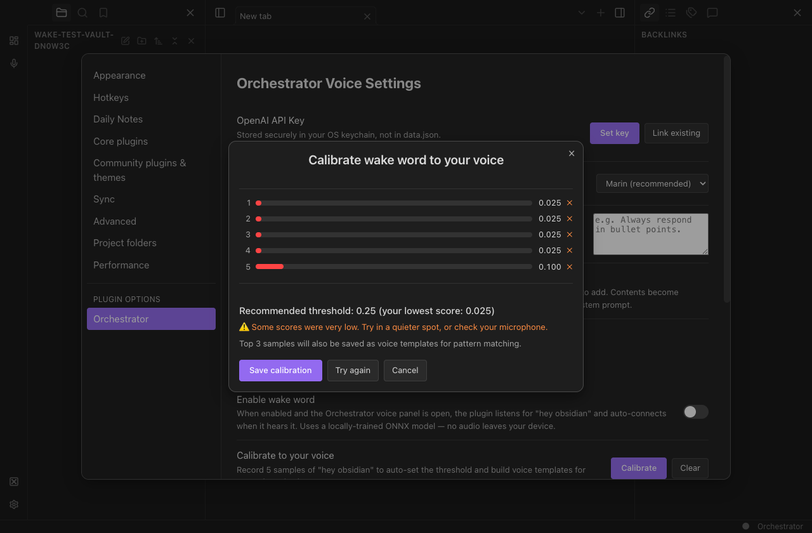

# Wake-word runtime compatibility

## Scope

Fix calibration startup in Geode 0.22.7 without changing its Content Security Policy. The previous build attempted to import ONNX's JS factory from a blob URL, which the host blocks. Once corrected, the same policy also prevented AudioWorklet module loading.

The fix uses ONNX Runtime 1.26.0's official bundled WASM entry point with a cached binary and single-threaded execution. AudioWorklet is retained where supported; hosts that reject it use buffered ScriptProcessor PCM capture with explicitly silent output. ScriptProcessor is deprecated but present in desktop Chromium, and its main-thread timing is a tradeoff on busy renderers.

## Checks

- `npx tsc --noEmit`: clean.
- `npm test`: 126 passing tests in 17 files, including capture/error/cleanup and rename-migration regressions.
- `npm run build`: passed.
- `scripts/test-geode-wake.mjs`: installed Geode, isolated synthetic vault/profile, real ONNX runtime and all three models, synthetic oscillator microphone. Original regression failed with the exact blocked-module error before the fix.
- Model fixture files byte-match the committed models.
- Five calibration samples completed, three 96-element templates saved, and captured tracks ended afterward. Simulated microphone denial rendered the accurate startup error. Unit coverage verifies cleanup when the modal closes during startup.
- No Geode CSP changes, dependency version changes, real microphone recordings, API keys, or paid voice sessions.

## Visual evidence

Local installed Geode 0.22.7, 1280×840, dark mode, fresh Threads Orchestrator 0.2.0 install; refreshed 2026-09-24. Five sample results and calibration save controls are visible. These are synthetic tones, not a speech-recognition accuracy result.

## Limits

Actual speech accuracy, physical microphone permissions, heavy-renderer performance, and the real Obsidian application are not covered by this synthetic test. Existing dependency audit findings are unchanged. Only desktop is supported by this plugin.
